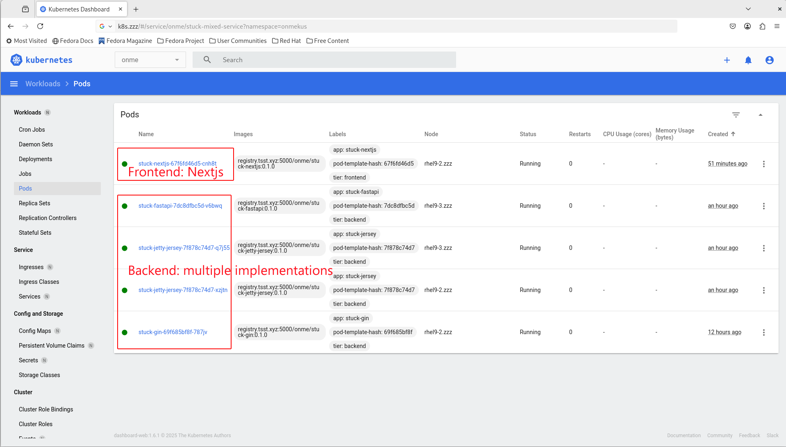

# APIs writen in Python (FastAPI)

## Dockerfile highlignts

* Install MariaDB Connector/C

```bash
RUN apt-get update && apt-get install -y libmariadb3 libmariadb-dev gcc
```

* Run code from wheel package instead of xxx.py

```bash
RUN pip install --no-cache-dir /app/*.whl
CMD ["uvicorn", "stuck_fastapi.main:app", "--host", "0.0.0.0", "--port", "8000"]
```

## Installation

### Build a wheel package

```bash
sudo dnf install python3.14

python3.14 -m ensurepip

python3.14 -m pip install --upgrade pip

python3.14 -m pip install --upgrade build

python3.14 -m build
```

### Prepare necessary files for docker image

```bash
zzz/
├── Dockerfile
├── requirements.txt
├── stuck.properties
├── dist/
│   └── stuck_fastapi-0.0.1-py3-none-any.whl
```

## Dockerize

### Perform a [wheel build](#build-a-wheel-package) first

### Build a docker image

```bash
cp ./k8s/Dockerfile ./

docker build -t [your.private.registry]:5000/[zzz]/stuck-fastapi:0.1.0 .

docker images

docker run -p 8000:8000 [your.private.registry]:5000/[zzz]/stuck-fastapi:0.1.0
```

### Push to private docker registry for K8S use

 ```bash
 #Push to private docker registry for K8S use
 docker push [your.private.registry]:5000/[zzz]/stuck-fastapi:0.1.0
 ```

### Copy k8s yaml to k8s cluster and deploy

 ```bash

 kubectl create -f stuck-fastapi.yaml

# in case to change lables
 kubectl -n zzz label pods -l app=stuck-fastapi tier=backend
 ```


