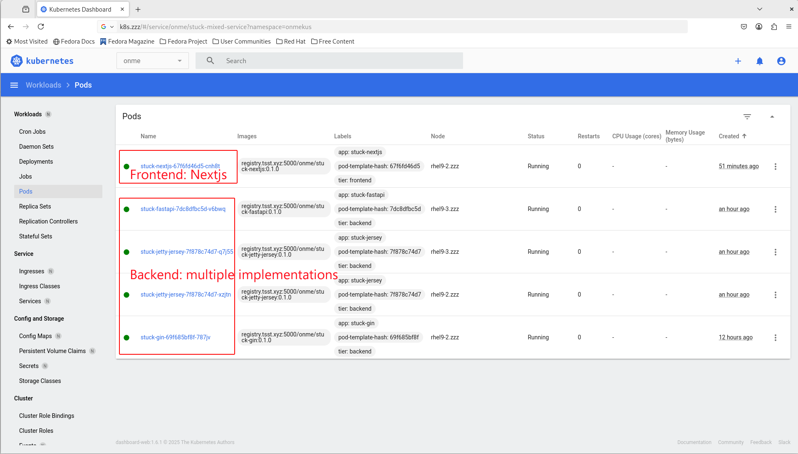

# APIs writen in Go (Gin)

## Installation

### Binary

To build the binary, run the following:

```bash
$ go build -o stuck_gin
```

To run the binary, run the following:

```bash
$ ./stuck_gin
```

Or simply:

```bash
$ go run main.go
```

## Dockerize

### Build a docker image

```bash
cp ./k8s/Dockerfile ./

docker build -t [your.private.registry]:5000/[zzz]/stuck-gin:0.1.0 .

docker images

docker run -p 8000:8000 -d [your.private.registry]:5000/[zzz]/stuck-gin:0.1.0
```

### Push to private docker registry for K8S use

 ```bash
 docker push [your.private.registry]:5000/[zzz]/stuck-gin:0.1.0
 ```

### Copy k8s yaml to k8s cluster and deploy

 ```bash
 kubectl create -f stuck-gin.yaml
 ```

 
