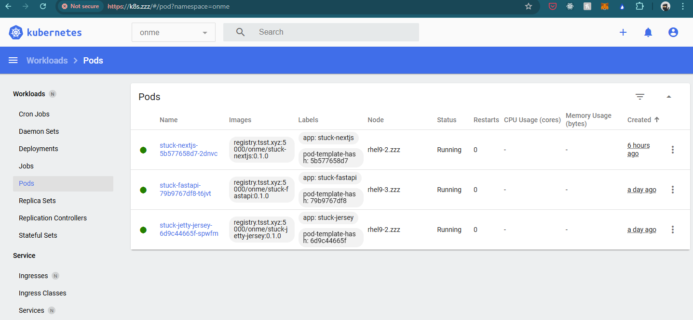

# Jetty and Jersy

## Build a jar with maven

```bash
mvn -DskipTests package -U
```

## Prepare necessary files for docker image

```bash
zzz/
├── Dockerfile
├── io.onme.stuck-jetty-jersey-0.1.0-SNAPSHOT-jar-with-dependencies.jar
├── stuck.properties
```

## Build docker image

```bash
docker build -t [your.private.registry]:5000/[zzz]/stuck-jetty-jersey:0.1.0 .
docker run -p 8000:8000 [your.private.registry]:5000/[zzz]/stuck-jetty-jersey:0.1.0

#Push to private docker registry for K8S use
docker push [your.private.registry]:5000/[zzz]/stuck-jetty-jersey:0.1.0
```

## Copy manifest file to k8s cluster and deploy

 ```bash
 kubectl create -f stuck-jetty-jersey.yaml
 ```


