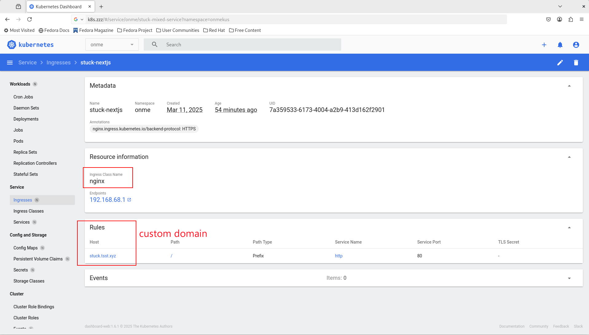

This is a [Next.js](https://nextjs.org) project bootstrapped with [`create-next-app`](https://nextjs.org/docs/app/api-reference/cli/create-next-app).

## Getting Started

* First, make copy of **.env.example** and rename to **.env**

Put values from instructions of [Auth0.md](../Auth0.md) and [TalkJS.md](../TalkJS.md)

* Second, run the development server:

```bash
npm run dev
# or
yarn dev
# or
pnpm dev
# or
bun dev
```

Open [http://localhost:3000](http://localhost:3000) with your browser to see the result.

You can start editing the page by modifying `app/page.tsx`. The page auto-updates as you edit the file.

This project uses [`next/font`](https://nextjs.org/docs/app/building-your-application/optimizing/fonts) to automatically optimize and load [Geist](https://vercel.com/font), a new font family for Vercel.

## Dockerize

Must run **npm run dev** once to generate **public/__ENV.js** prior to run docker build

```bash
cp ./k8s/Dockerfile ./

docker build --progress=plain -t registry.tsst.xyz:5000/onme/stuck-nextjs:0.1.0 .
docker push registry.tsst.xyz:5000/onme/stuck-nextjs:0.1.0
docker run -p 3000:3000 registry.tsst.xyz:5000/onme/stuck-nextjs:0.1.0

# Or deploy to your on premises K8S
kubectl create -f ./k8s/stuck-nextjs.yaml
```

### Explose by Ingress


